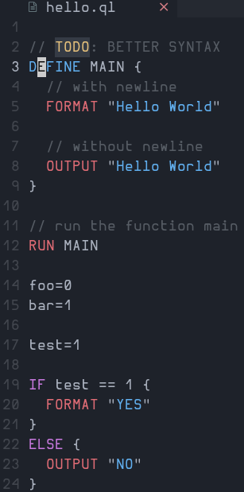

# QLang
Ql Programming Language written in Python

SERVER:

EXAMPLE:

Store's the modules related to Graphics.

[src/Graphics](./src/Graphics/)

 This is where examples located

[examples/](./examples/)

Implementation
  Default: [Python](https://python.org)

Implemented:
  - Web Server (PS: You still need to for now manually create a style.css, edit the index.html
  and also manually create the main.js :) )
  - INPUT function
