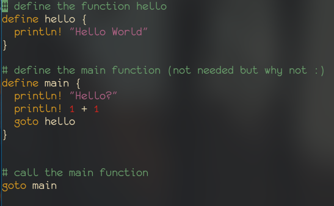

## Mince Programming Language  

### Examples

Here is a example of a mince script

### FILES & DIRECTORIES
- the directory [editor](./editor) is where the all editor support will be stored.
- the directory [examples](./examples) is where all examples are stored.
- the directory [mcs](./mcs) or I call it 'mince extensions' will soon contain extensions for mince.

### INSTALLATION
##### For linux users
- to install the editor support files use the custom [make](./editor/make) script in the editor directory
- for linux users (like me!) use make to install mince to local bin directory
##### For Windows
- run the file using command prompt the make script and makefile is not needed 

### NEW
- added [sedit](https://github.com/nathan-the-coder/sedit) - the editor i've made specifically for my language.

### REVAMPED
- new name and syntax for this language. (2 times revamped)

### REMOVED
- removed server support, git integration, user input.

### Notes
- The 'print!' and 'println!' function is like rust's print functions.
- Currently I wasn't able to implement function parameters because its hard to code :).
