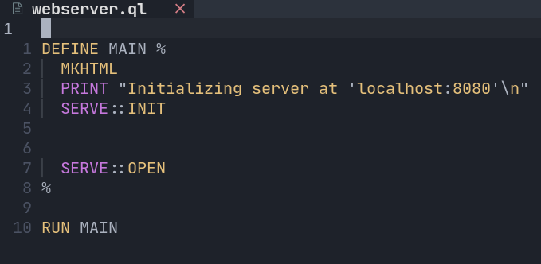
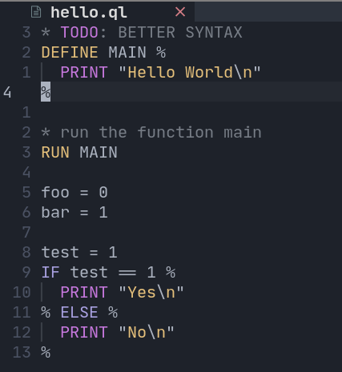

# QLang
Ql Programming Language written in Python

SERVER:

EXAMPLE:

Implementation
  Default: [Python](https://python.org)

> Implemented:
>  - Web Server (PS: You still need to for now manually create a style.css, edit the index.html
>  and also manually create the main.js :) )
>  - INPUT function

### NEW
  1. added [setup.py](./setup.py) to install additional modules and the python script itself.
  2. added [log.py](./scripts/log.py) - used for pretty printing error's, warning's and to print msg.
  3. added [shop.py](./scripts/shop.py) - used to run shell commands in python and used in [setup.py](./setup.py). 
  4. fixes the server functions to work properly
  5. Successfully Implemented First git integration 
    1. Cloning repos on ~/repo.

## Disclaimer
> you need to be on the directory, where the server will be for ql to gen files on that dir only
